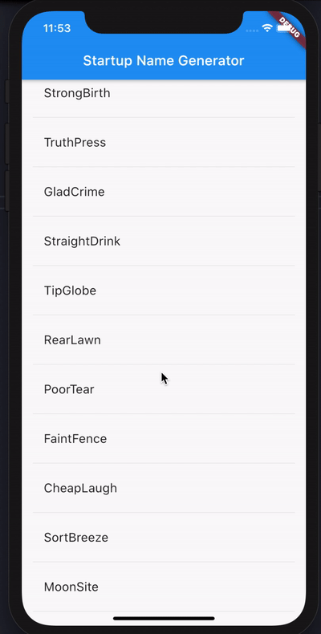

# First_flutter_app

## this app is the flutter tutorial result

## Installation

- This project is a basic app with flutter framework

### Clone

- Clone this repo to your local machine using `https://github.com/lerimeur/first_flutter_app.git`

### Setup

- First of all you need to install flutter on your machine

> install flutter
- `https://flutter.dev/docs/get-started/install`
